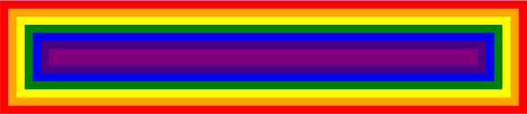

# PonyRender

A tiny toy HTML render engine based on [Robinson](https://github.com/mbrubeck/robinson). This project is aimed to learn basic concepts about how a web render engine works. So it is definitely not suitable to fit any real application condition.

Now PonyRender is under **slow** development.

## Beyond Robinson

Based on Robinson's source code, PonyRender did further work listed below:

- Allow comment like `<!-- This is a comment -->`
- Add unit tests
- Allow `style` tag

## Demo

```html
<style>
    * { display: block; padding: 12px; }
    .a { background: #ff0000; }
    .b { background: #ffa500; }
    .c { background: #ffff00; }
    .d { background: #008000; }
    .e { background: #0000ff; }
    .f { background: #4b0082; }
    .g { background: #800080; }
</style>
<div class="a">
    <div class="b">
        <div class="c">
            <div class="d">
                <div class="e">
                    <div class="f">
                        <div class="g">
                        </div>
                    </div>
                </div>
            </div>
        </div>
    </div>
</div>
```


